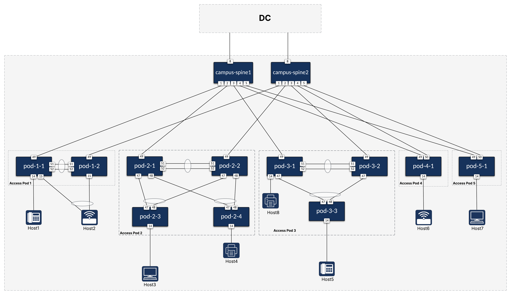
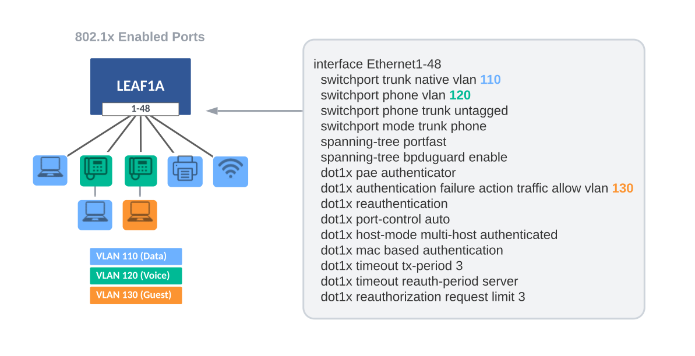

# Example for Campus Fabric

## Introduction

This example describes and includes all the AVD files used to build a Campus Fabric. The spine nodes provide L3 routing of SVIs, and the L2 leaf nodes support 802.1x Network Access Control (NAC) with port ranges.

## Design Overview

### Physical Campus Fabric Topology

In a Campus network, it is common to refer to the location of the switches as **MDF** (Main Distribution Frame) and **IDFs** (Independent Distribution Frame). Throughout this example, we refer to the spine nodes as the MDF and the leaf nodes as the IDFs. This example shows various switch types and common ways of cabling the IDF to the MDF.

- MDF
  - Two Spine nodes
- IDFs
  - POD1 supporting 96 users with two leafs (1RU - 48 ports each)
  - POD2 supporting 192 users with 4 leafs (1RU - 48 ports each)
  - POD3 supporting 144 users with 3 leafs (1RU - 48 ports each)
  - POD4 supporting 48 users with 1 leaf (1RU - 48 ports each)
  - POD5 supporting 48 users with 1 leaf (1RU - 48 ports each)

The drawing below shows the physical topology used in this example. The interface assignment shown here are referenced across the entire example, so keep that in mind if this example must be adapted to a different topology.



## Build Fabric Topology

AVD Fabric Input Variables

To apply AVD input variables to the nodes in the fabric, we make use of Ansible group_vars. How and where you define the variables is your choice. The group_vars table below is one example of AVD fabric variables.

| group_vars/              | Description                                   |
| ------------------------ | --------------------------------------------- |
| DC1.yml                  | Global settings for all devices               |
| DC1_FABRIC.yml           | Fabric, Topology, and Device settings         |
| DC1_SPINES.yml           | Device type for Spines                        |
| DC1_LEAFS.yml            | Device type for Leafs                         |
| DC1_NETWORK_SERVICES.yml | VLANs/SVIs                                    |
| DC1_NETWORK_PORTS.yml    | Port Profiles and Network Port Ranges         |

The tabs below show the Ansible **group_vars** used in this example.


## Network Services

The Network Services data model is stored in the **DC1_NETWORK_SERVICES** group_var tab above. Each IDF will have three unique VLANs to support Data, Voice, and Guest networks. The spine nodes will provide routing for these VLANs via locally assigned SVIs.

### VLAN/IP Subnet Assignment

| IDF  | Data                 | Voice                 | Guest                 |
| ---- | -------------------- | --------------------- | --------------------- |
| IDF1 | 110 - (10.1.10.0/23) | 120 - (10.1.20.0/23)  | 130 - (10.1.30.0/23)  |
| IDF2 | 210 - (10.2.10.0/23) | 220 - (10.2.20.0/23)  | 230 - (10.2.30.0/23)  |
| IDF3 | 310 - (10.3.10.0/23) | 320 - (10.3.20.0/23)  | 330 - (10.3.30.0/23)  |

## Port Profiles and Network Ports

AVD provides a way to standardize and reuse port profiles through a compact data model you can utilize across the network. The Network Ports data model is stored in the **DC1_NETWORK_PORTS** group_vars tab above. Each port is configured to support NAC and dynamically assigns the proper VLAN based on 802.1x authentication. Multiple device types (IP Phones, Workstations, Printers, Access Points, etc.) can share the same port configuration below.



The above sample port configuration is easily produced with `port_profiles` and `network_ports` data models. Each port has similar configuration items defined in `port_profiles`, while `network_ports` defines which switches and port ranges are to be applied. The `network_ports` data model allows regex to match switches and an `expand_range` filter to cover a range of ports. For details, see the documentation for [`port_profiles`](../../roles/eos_designs/docs/input-variables.md#port-profiles-settings) and [`network_ports`](../../roles/eos_designs/docs/input-variables.md#network-ports-settings).

## WAN/Core Edge

Lastly, we need to provide a way for traffic to exit the Campus Fabric via the WAN/Core Edge. This is easily accomplished using `underlay_routing_protocol` and `core_interfaces` to create point-to-point IP links to the WAN/Core and enable a routing protocol such as OSPF. This simple data model below is located at the bottom of the **group_vars/DC1_FABRIC.yml** file.

``` yaml
# Underlay Routing Protocol
underlay_routing_protocol: ospf

#### WAN/Core Edge Links ####
core_interfaces:
  p2p_links:
    - ip: [ 10.0.0.3/31, 10.0.0.2/31 ]
      nodes: [ SPINE1, WAN ]
      interfaces: [ Ethernet52/1, Ethernet1/1 ]
      include_in_underlay_protocol: true
    - ip: [ 10.0.0.5/31, 10.0.0.4/31 ]
      nodes: [ SPINE2, WAN ]
      interfaces: [ Ethernet52/1, Ethernet1/1 ]
      include_in_underlay_protocol: true
```

## Deploy Fabric

